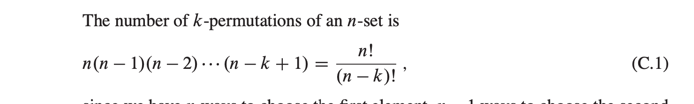
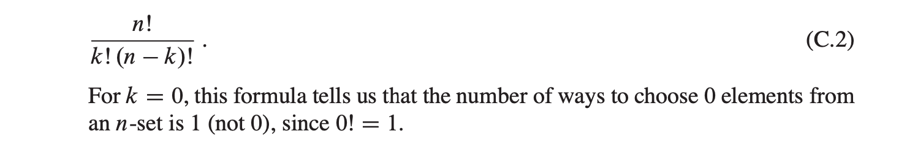
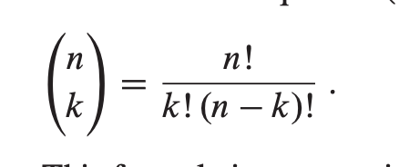
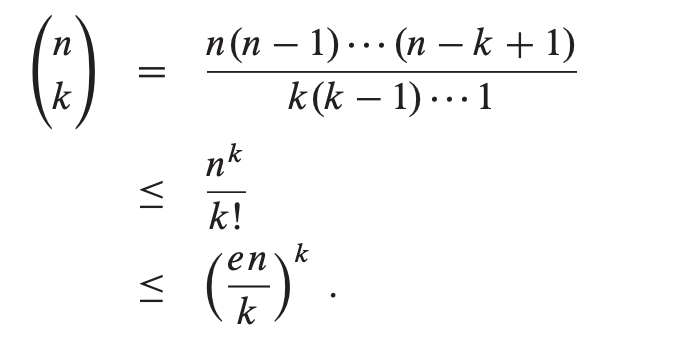

# Appendix C "Counting and Probability"
## C.1 Counting
### Rules of sum and product
- The rule of sum says that the number of ways to choose one element from one of two disjoint sets is the sum of the cardinalities of the sets |A U B| = |A| + |B|.
- The rule of product says that the number of ways to choose an ordered pair is the number of ways to choose the first element times the number of ways to choose the second element |A x B| = |A| * |B|.
### Strings
- a string simply means a finite sequence of characters
- An alphabet is a nonempty finite set
- here are 8 binary strings of length 3: 000, 001, 010, 011, 100, 101, 110, 111 In general for an n-bit string we get 2ˆ𝑛 possible strings.
### Permutations
- A permutation of a finite set S is an ordered sequence of all the elements of S, with each element appearing exactly once ,There are n! permutations of a set of n elements
- if S = {a,b,c} then S = abc, acb, bac, bca, cab, cba 
- we can choose the first element of the sequence in n ways, the second in n - 1 ways, the third in n - 2 ways, and so on.
- A k-permutation of S is an ordered sequence of k elements of S, with no ele- ment appearing more than once in the sequence
- -permutations of the set{a,b,c,d} are ab,ac,ad,ba,bc,bd,ca,cb,cd,da,db,dc :

### Combinations
- A k-combination of an n-set S is simply a k-subset of S, the 4-set{a,b,c,d} has six 2-combinations: ab,ac,ad,bc,bd,cd

### Binomial coefficients
- The binomial coefficients are the integers calculated using the formula

### Binomial bounds

 