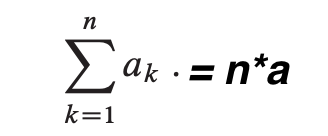
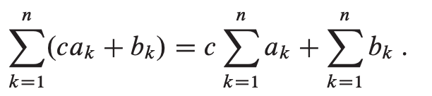
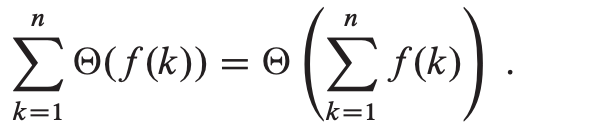
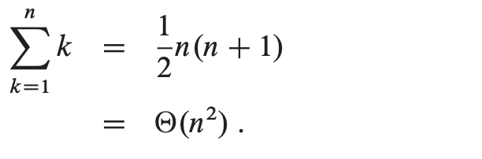
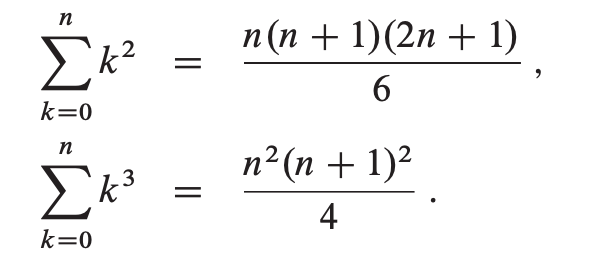

# Appendix A 
1. [main Summation formula](#main_summation_formula)
1. [Linearity](#linearity)
1. [Arithmetic series](#arithmetic_series)
1. [Sums of squares and cubes](#sums_of_squares_and_cubes)
1. [Geometric series](#geometric_series)

## main Summation formula

## Linearity

Likewise

## Arithmetic series

## Sums of squares and cubes
 

## Geometric series
x ≠ 1

summation is infinite and |x| < 1,

