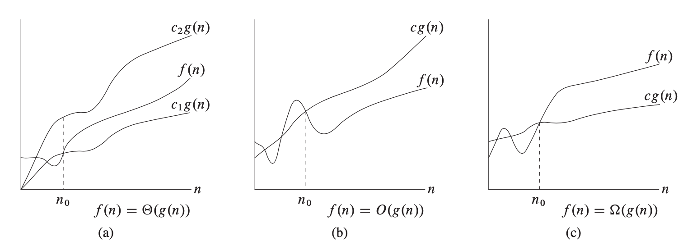
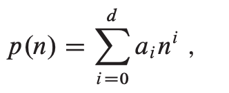

# Chapter 3
## Growth of Functions
## Asymptotic notation
- asymptotic notation use to describe the running times of algorithms

### O-notation  " Big oh " 
- upper bound 
- positive constant , 0 ≤ F(n) ≤ C g(n) , for all n ≥ n0

### Ω-notatio " Omega "
- lower bound
- positive constant , 0 ≤ C g(n) ≤ F(n) , for all n ≥ n0

### Θ-notation  " Theta "
-  average bound
- two positive constant , 0 ≤ C1 g(n) ≤ F(n) ≤ C2 g(n) , for all n ≥ n0
### o-notation " little oh "
- any positive constant
- 0 ≤ F(n) < C g(n) , for all n ≥ n0

### w-notatio " little Omega "
- any positive constant
-  0 ≤ C g(n) < F(n) , for all n ≥ n0

## Standard notations and common functions
### Monotonicity
- Monotonicity function
     - monotonically
         -  monotonically increasing if m ≤ n implies f (m) ≤ f (n)
         - monotonically decreasing if m ≤ n implies f (m) ≥ f (n)
     - strictly
         - strictly increasing if m < n implies f (m) < f (n)
         - strictly decreasing if m < n implies f (m) > f (n)
 
### Floors and ceilings
- floor of X
     -  the greatest integer less than or equal to x 
- ceiling of X
     - least integer greater than or equal to x  

### Modular arithmetic
- the value a mod n is the remainder (or residue) of the quotient a/n:

### Polynomials

- Exponentials
- Logarithms
- Factorials
- Functional iteration
- The iterated logarithm function
- Fibonacci numbers

