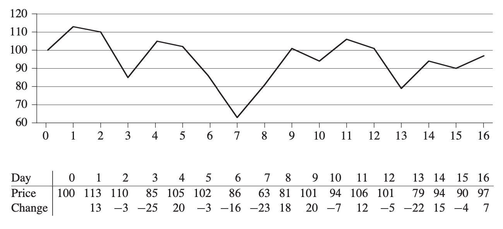

 # Divide-and-Conquer
 - devide problem into smallar instances of the same problems,Conquer the sub-problems by solving them recursively and Combine the solutions to the sub-problems into solution for the
 original problem
 ## Recurrences
 -  recurrence is an equation or inequality that describes a function 
 ### three methods for solving recurrences
 -  substitution method
     - guess a bound and then use mathematical in- duction to prove our guess correct
 -  recursion-tree method
     - converts the recurrence into a tree whose nodes represent the costs incurred at various levels of the recursion
 -  master method
     -  provides bounds for recurrences of the form T(n) = aT(n/b) + f(n)

 ---
 
 ## A brute-force solution
 -  try every possible solution
 - for i = 1  ---> n
 - for j = i+1 ---> n-1 
 - Θ(nˆ2)

 ## The maximum-subarray problem
 -  do transformation then use Divide-and-Conquern technique
